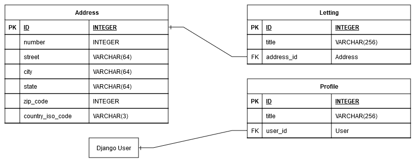

oc_lettings_site documentation
==============================

This is the technical documentation for Orange County Lettings Website app.
the goal of this site is to provide lettings services to peoples.

tech stack
----------

The tech stack for this project includes:
   - Django
   - Python
   - SQLite
   - HTML/CSS/JS
   - docker
   - GitHub Actions
   - Git
   - ReadTheDocs
   - Sphinx

Database structure
------------------

The database structure for the project is as follows:

App structure
-------------

The app have a main app called oc_lettings_site and 2 sub apps called lettings and profiles.
You can find the structure of each app on the sidebar.

quick start
-----------

To get started quickly with the project, refer to the :doc:`quick_start`.

Full Installation & Deploy Guide
--------------------------------

For detailed installation instructions, see the :doc:`full_install`.

.. toctree::
   :maxdepth: 2
   :hidden:

   quick_start
   full_install
   oc_lettings_site/oc_lettings_site
   lettings/lettings
   profiles/profiles
